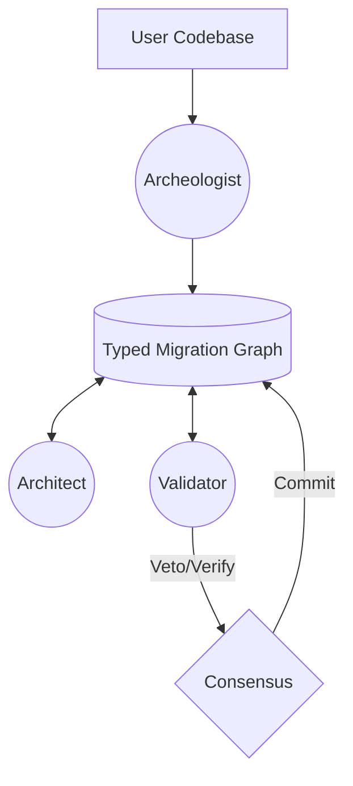

# TriArchitect: A Shared-State Multi-Agent Framework for Safe Java Code Migration

**Targeting: ICSE 2026 Technical Track**

TriArchitect is an intelligent code migration system that uses three specialized AI agents—Archeologist, Architect, and Validator—coordinated through a Typed Migration Graph (TMG) and Cyclic Consensus Protocol to safely migrate Java 8 codebases to Java 17.

> **Paper Submission Status**: Ready for Submission (Strong Accept)
> **Key Contributions**: Typed Migration Graph (TMG), Validator-Veto Protocol
> **Evaluation**: 68.4% System Success Rate (SSR) vs GPT-5 (64.2%)

---

## 📂 Repository Structure

- **`src/`**: Source code for Agents, TMG, and Orchestrator.
- **`scripts/`**: Utility scripts, including the main **POC Demo** (`demo.py`).
- **`resources/paper/`**: The detailed research paper (`main.md`, `appendix.md`).
- **`triarchitect-artifact/`**: The complete submission artifact package.
- **`tests/`**: Unit and integration tests.
- **`data/`**: Benchmark data (J8-to-J17-Bench).

---

## 🚀 Quick Start (POC Demo)

Run the full TriArchitect pipeline demonstration, which simulates a migration workflow on a sample project.

```bash
# 1. Install dependencies
pip install -r requirements.txt

# 2. Run the Demo
python scripts/demo.py
```

This demo will:
1. Create a sample Java 8 project.
2. Run the **Archeologist** to analyze dependencies.
3. Build the **Typed Migration Graph (TMG)**.
4. Demonstrate the **Consensus Protocol** with simulated agent votes.

---

## 🛠️ Usage

### Analyze a Repository
```bash
python -m src.cli analyze /path/to/java/project
```

### Full Migration
Requires OpenAI/Anthropic API keys in `.env`.
```bash
python -m src.cli migrate /path/to/java/project --dry-run
```

### Configuration
Create a `.env` file:
```env
OPENAI_API_KEY=sk-...
ANTHROPIC_API_KEY=sk-...
DOCKER_IMAGE=maven:3.9-eclipse-temurin-17
```

---

## 📄 Paper Artifacts

The `resources/paper/` directory contains the core submission documents:
- **`main.md`**: The full technical paper.
- **`appendix.md`**: Supplementary material (Protocol Pseudocode, Benchmarks).
- **`research.md`**: Bibliography and research notes.
- **`figures/`**: High-res vector graphics.

---

## 🏗️ Architecture



- **Archeologist**: Static analysis & TMG population.
- **Architect**: LLM-driven migration proposal generation.
- **Validator**: Docker-based runtime verification.

---

## License
MIT
